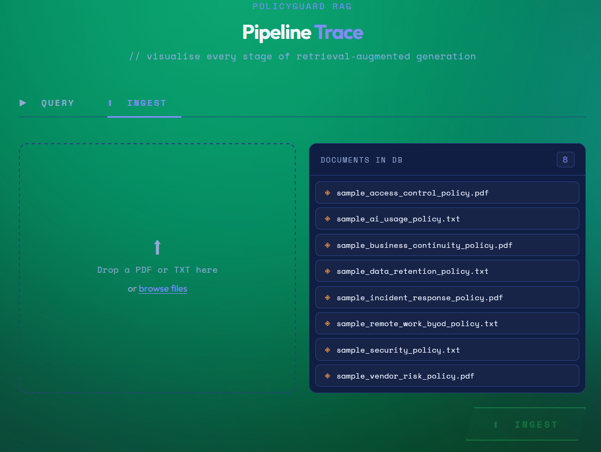
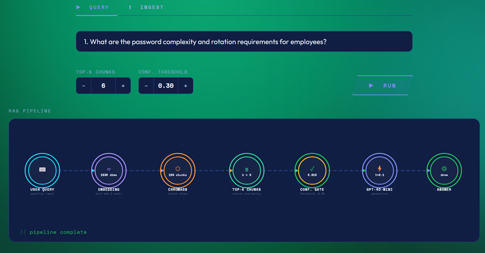
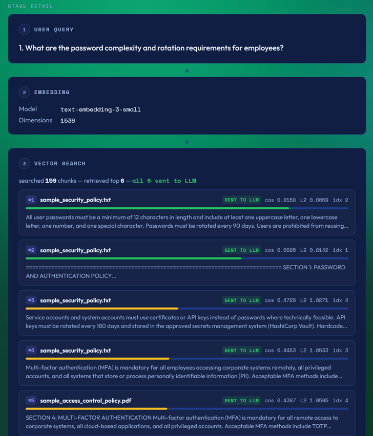
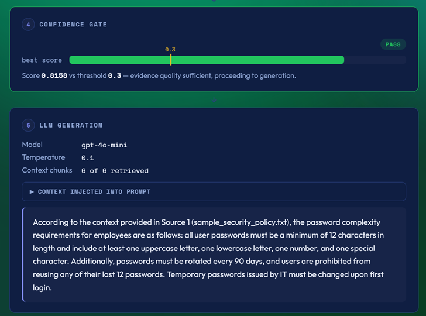

# PolicyGuard RAG

A production-style REST API and visual interface that ingests security and compliance documents and answers policy questions with grounded citations. When retrieved evidence is weak, the system refuses to answer rather than hallucinating — returning a confidence score and directing the user to consult a security expert.

Supports **PDF** and **TXT** files. Multiple documents can be ingested and queries retrieve from all of them simultaneously, citing which document each answer comes from.

A built-in **pipeline visualization UI** at `/viz` lets you watch every stage of retrieval-augmented generation in real time: embedding, ChromaDB vector search with cosine similarity scores, confidence gate, and GPT-4o-mini generation.

---

## Architecture

```
POST /ingest        →  parse (PDF/TXT)  →  chunk  →  embed (text-embedding-3-small)  →  ChromaDB
POST /query         →  embed question   →  similarity search  →  confidence gate  →  GPT-4o-mini  →  cited answer
POST /query/trace   →  same as /query, but returns full pipeline trace (scores, gate decision, context sent to LLM)
GET  /viz           →  interactive pipeline visualization UI
```

- **Embeddings**: OpenAI `text-embedding-3-small` (1536 dimensions)
- **Vector store**: ChromaDB (local persistent at `./chroma_db/`)
- **LLM**: OpenAI `gpt-4o-mini` (temperature 0.1)
- **Confidence gate**: cosine similarity threshold — checks the best-scoring chunk; if below threshold, refuses to answer without calling the LLM
- **Per-chunk filtering**: only chunks that individually meet the threshold are included in the LLM context window

---

## Setup

```bash
# 1. Create and activate virtual environment
python -m venv venv
venv\Scripts\activate        # Windows
# source venv/bin/activate   # macOS/Linux

# 2. Install dependencies
pip install -r requirements.txt

# 3. Configure environment
cp .env.example .env
# Edit .env and set your OpenAI API key

# 4. Start the server
uvicorn app.main:app --reload
```

The API will be available at `http://localhost:8000`.
- Interactive docs (Swagger UI): `http://localhost:8000/docs`
- Pipeline visualization UI: `http://localhost:8000/viz`

---

## Visualization UI (`/viz`)

Open `http://localhost:8000/viz` in a browser to access the visual interface. It has two tabs.

**Ingest tab** — drag and drop a PDF or TXT file (or browse to select one) and click INGEST. The sidebar lists every document currently in the knowledge base and refreshes automatically after each upload.



**Query tab** — type a policy question, optionally adjust the Top-K and confidence threshold steppers, and click RUN. An animated SVG pipeline graph lights up node by node as the request flows through the system.



Below the graph, stage detail cards expand the full data at each step. The vector search card shows every retrieved chunk with its cosine similarity score, a color-coded confidence bar, and a **SENT TO LLM** / **FILTERED OUT** badge indicating which chunks actually reached the model.



The confidence gate card shows the best score against the threshold on a visual bar. If the gate passes, the LLM generation card displays the model, temperature, how many chunks were used, the exact context injected into the prompt (expandable), and the grounded answer.



Two stepper controls let you adjust parameters before running:
- **Top-K Chunks** (1–20, default 5): how many chunks ChromaDB returns
- **Conf. Threshold** (0.05–0.95, default 0.25): minimum cosine similarity to answer, and the per-chunk filter for what gets sent to the LLM

---

## Endpoints

### GET `/health`
```bash
curl http://localhost:8000/health
# {"status": "ok"}
```

### GET `/documents`
Lists all documents currently in the knowledge base.
```bash
curl http://localhost:8000/documents
```
```json
{
  "documents": ["access_control_policy.pdf", "security_policy.txt"],
  "total": 2
}
```

### POST `/ingest`
Upload a PDF or TXT document. Re-ingesting the same filename upserts (overwrites) existing chunks.
```bash
# Using the included helper script (recommended on Windows)
python scripts/test_ingest.py samples/sample_security_policy.txt

# Or with curl
curl -X POST http://localhost:8000/ingest \
  -F "file=@security_policy.pdf"
```
```json
{ "status": "ok", "filename": "security_policy.pdf", "chunks_stored": 42 }
```

### POST `/query`
Ask a question. Accepts optional `top_k` and `confidence_threshold` parameters.
```bash
curl -X POST http://localhost:8000/query \
  -H "Content-Type: application/json" \
  -d '{"question": "How often must passwords be rotated?", "top_k": 5, "confidence_threshold": 0.25}'
```

**Confident answer:**
```json
{
  "answered": true,
  "answer": "Passwords must be rotated every 90 days. (Source 1: security_policy.txt)",
  "confidence": 0.82,
  "sources": [
    { "document": "security_policy.txt", "excerpt": "All user passwords must be rotated every 90 days...", "score": 0.82 }
  ]
}
```

**Refusal (weak evidence or off-topic):**
```json
{
  "answered": false,
  "reason": "Insufficient evidence in knowledge base. Confidence: 0.12. Please consult a security expert.",
  "confidence": 0.12,
  "sources": []
}
```

### POST `/query/trace`
Same as `/query` but returns the full pipeline trace — useful for debugging or powering custom UIs.
```bash
curl -X POST http://localhost:8000/query/trace \
  -H "Content-Type: application/json" \
  -d '{"question": "What MFA methods are permitted?", "top_k": 5, "confidence_threshold": 0.25}'
```

Returns `TraceResponse` with: embedding model/dimensions, total chunks in collection, all retrieved chunks with L2 distances and cosine similarities, `used_in_context` flag per chunk, gate decision, generation model/temperature, context injected into the LLM, and final answer.

---

## How the confidence gate works

Every query embeds the question and runs a cosine similarity search against all stored chunks.

1. ChromaDB returns the top-K chunks ranked by cosine similarity (converted from L2 distance via `score = 1 - L2² / 2`)
2. The **best chunk's score** is compared against the threshold (default **0.25**)
   - **Below threshold**: return `answered: false`, no LLM call made
   - **Above threshold**: proceed to generation
3. Only chunks whose **individual score** meets the threshold are included in the LLM context — below-threshold chunks are filtered out even if top-K returned them

This prevents hallucination in two ways: refusing entirely when evidence is too weak, and excluding low-confidence chunks from the context even when the gate passes.

---

## Sample documents

Eight sample policy documents are included for testing:

| File | Type | Content |
|------|------|---------|
| `sample_security_policy.txt` | TXT | Password complexity/rotation, MFA, data classification |
| `sample_data_retention_policy.txt` | TXT | Retention schedules, archival, secure disposal, legal holds |
| `sample_access_control_policy.pdf` | PDF | Least privilege, MFA requirements, access reviews, termination |
| `sample_incident_response_policy.pdf` | PDF | Severity levels, response phases, GDPR notification, evidence |
| `sample_remote_work_byod_policy.txt` | TXT | VPN, BYOD MDM enrollment, WPA2/WPA3, stipends |
| `sample_ai_usage_policy.txt` | TXT | Approved AI tools, data classification for AI, IP ownership |
| `sample_business_continuity_policy.pdf` | PDF | RTO/RPO tiers, backup retention, failover, tabletop testing |
| `sample_vendor_risk_policy.pdf` | PDF | Vendor tiers, SOC 2 requirements, DPA, fourth-party risk |

To ingest all sample documents:
```bash
python scripts/test_ingest.py samples/sample_security_policy.txt
python scripts/test_ingest.py samples/sample_data_retention_policy.txt
python scripts/test_ingest.py samples/sample_access_control_policy.pdf
python scripts/test_ingest.py samples/sample_incident_response_policy.pdf
python scripts/test_ingest.py samples/sample_remote_work_byod_policy.txt
python scripts/test_ingest.py samples/sample_ai_usage_policy.txt
python scripts/test_ingest.py samples/sample_business_continuity_policy.pdf
python scripts/test_ingest.py samples/sample_vendor_risk_policy.pdf
```

To regenerate the PDF files:
```bash
python scripts/generate_sample_pdfs.py
```

---

## Example queries

```json
{"question": "What are the password complexity and rotation requirements?"}
{"question": "How long must financial records be retained?"}
{"question": "What MFA methods are allowed for privileged accounts?"}
{"question": "What must happen within 72 hours of a data breach?"}
{"question": "What are the RTO and RPO requirements for Tier 1 systems?"}
{"question": "Which AI tools are approved for use with confidential data?"}
{"question": "What are the requirements for Tier 1 vendor due diligence?"}
{"question": "What is the VPN requirement for remote workers?"}
{"question": "What is the boiling point of water?"}
{"question": "Who won the last FIFA World Cup?"}
```

The last two should be refused — no relevant policy chunks exist for them.

---

## Project structure

```
app/
├── main.py          # FastAPI app, endpoints (/ingest /query /query/trace /documents), timing middleware
├── ingestor.py      # PDF/TXT parsing, paragraph chunking, embedding, ChromaDB upsert
├── retriever.py     # Question embedding, vector search, L2→cosine conversion; retrieve_with_trace()
├── generator.py     # Confidence gate, per-chunk filtering, GPT-4o-mini call; generate_answer_with_trace()
├── models.py        # Pydantic schemas: QueryRequest, QueryResponse, TraceChunk, TraceResponse
└── static/
    └── index.html   # Pipeline visualization UI (Query + Ingest tabs, animated SVG graph)
docs/
├── GETTING_STARTED.md
└── TECHNICAL.md
samples/             # 8 sample policy documents (TXT + PDF)
scripts/
├── test_ingest.py           # CLI wrapper around POST /ingest
└── generate_sample_pdfs.py  # Generates sample PDF policy files using PyMuPDF
requirements.txt
.env.example         # Copy to .env and set OPENAI_API_KEY
CLAUDE.md            # Codebase guidance for Claude Code
```
